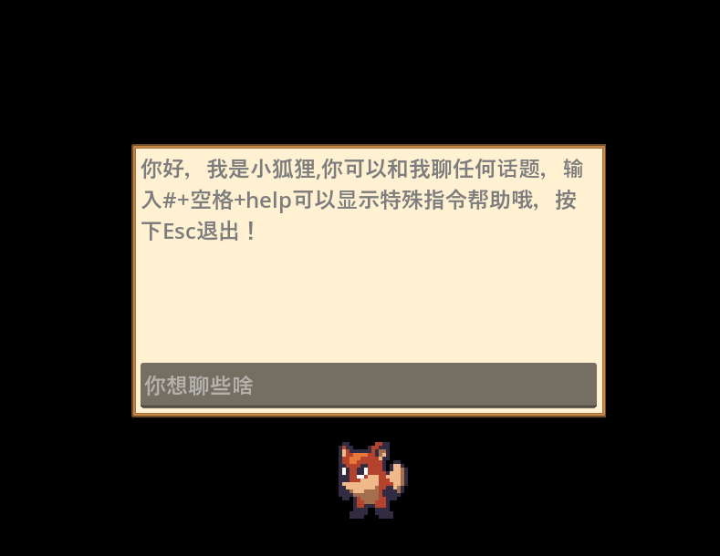

## 使用说明
- 这是一个接入了大模型API的桌面宠物，使用Godot引擎开发，引擎版本4.3
- 你需要申请通义千问API并修改llmapi.gd中的代码，或者使用Ollama的本地模型
- 鼠标右键按住可以拖动，左键可以呼叫出聊天栏
- 在聊天栏中可以和大模型对话，也可以输入 # help得到特殊指令说明
- 目前支持如下功能：
  - 和AI聊天
  - 跟随鼠标移动
  - 放烟花
  - 冥想休息
- 计划加入功能：
  - 番茄钟
  - 休闲小游戏

程序界面

